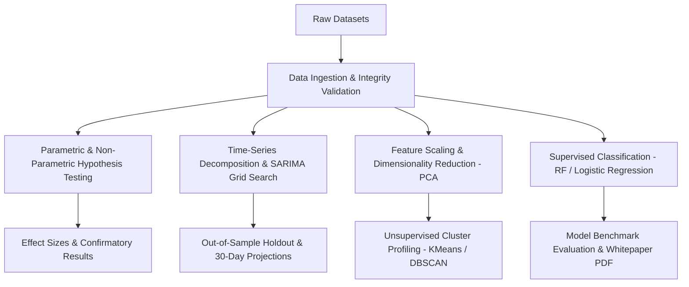

# Architecture & Methodological Flow

This document outlines the methodological and structural framework governing the data pipelines, hypothesis tests, and modeling workflows in this repository.

## Modular Design Guidelines
1. **Determinism:** All random operations use seeded generators (`random_state=42`).
2. **Confirmatory Separation:** Preregistered analysis plans are strictly separated from exploratory data transformations.
3. **Pipeline Encapsulation:** Scaling and transformations are packaged inside scikit-learn `Pipeline` objects to prevent data leakage.
